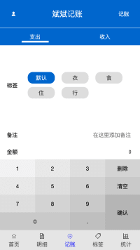
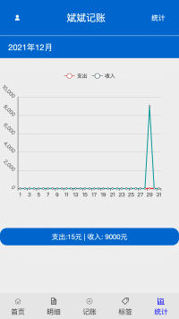

# 斌斌记账

## 项目介绍

访问地址：http://account.jzzz66.cn

这是一款基于 vue+ts 的单页面移动的记账应用，实习时学习 ts 所写，使用到了许多零零散散的知识，知识是无止境的.
主要实现的功能包括记账页面，标签管理，统计页面，数据持久化等。  
同时引入了 Echarts 来做数据可视化，采用 Vuex + LocalStorage 做全局状态管理与数据持久化。  
新手想找项目练习的时候可以看看。

## 技术栈

Vue + Vue Router + Vuex + Typescript + Echart
| 相关库名称 | 在线地址 🔗 |
| --------- | -------- |
| Vue | https://cn.vuejs.org/ |
| Vue-Router | https://router.vuejs.org/zh/ |
| Echare | https://echarts.apache.org/zh/index.html |
| Vuex | https://vuex.vuejs.org/zh/ |
| Typescript | https://www.tslang.cn/docs/home.html |

##项目截图

|||
